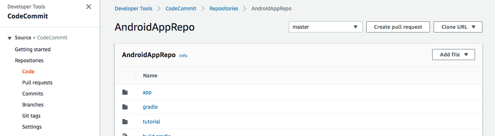
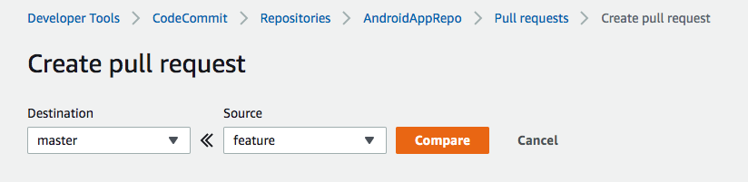
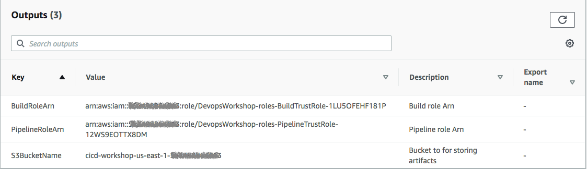
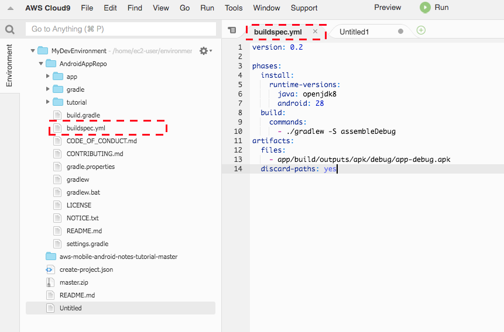
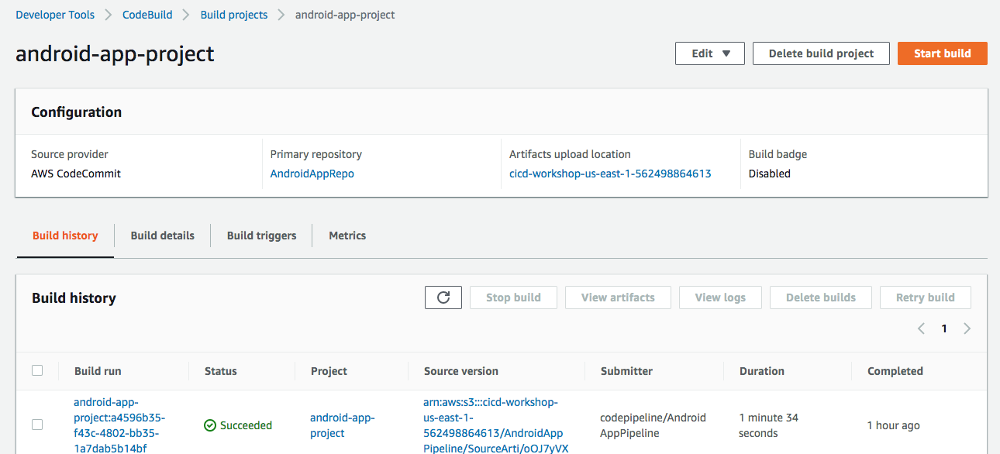

## Lab 1 - Build project on the cloud

### AWS Cloud9 IDE - Set up

AWS Cloud9 is a cloud-based integrated development environment (IDE) that lets you write, run, and debug your code with just a browser. It includes a code editor, debugger, and terminal. Cloud9 comes pre-packaged with essential tools for popular programming languages and the AWS Command Line Interface (CLI) pre-installed so you don't need to install files or configure your laptop for this workshop. Your Cloud9 environment will have access to the same AWS resources as the user with which you logged into the AWS Management Console.

Take a moment now and setup your Cloud9 development environment.

### ✅  Step-by-step Instructions

1. Go to the AWS Management Console, click **Services** then select **Cloud9** under Developer Tools.
2. Click **Create environment**.
3. Enter `MyDevEnvironment` into **Name** and optionally provide a **Description**.
4. Click **Next step**.
5. You may leave **Environment settings** at their defaults of launching a new **t2.micro** EC2 instance which will be paused after **30 minutes** of inactivity.
6. Click **Next step**.
7. Review the environment settings and click **Create environment**. It will take several minutes for your environment to be provisioned and prepared.
8. Once ready, your IDE will open to a welcome screen. Below that, you should see a terminal prompt similar to:  You can run AWS CLI commands in here just like you would on your local computer. Verify that your user is logged in by running the following command.

```console
aws sts get-caller-identity
```

You'll see output indicating your account and user information:
```console
{
    "Account": "123456789012",
    "UserId": "AKIAI44QH8DHBEXAMPLE",
    "Arn": "arn:aws:iam::123456789012:user/user"
}
```

Keep your AWS Cloud9 IDE opened in a tab throughout this workshop as we'll use it for activities like cloning, pushing changes to repository and using the AWS CLI.

### 💡 Tips

Keep an open scratch pad in Cloud9 or a text editor on your local computer for notes. When the step-by-step directions tell you to note something such as an ID or Amazon Resource Name (ARN), copy and paste that into the scratch pad.

---

### Stage 1: Create an AWS CodeCommit Repository

**_To create the AWS CodeCommit repository (console)_**

1. Open the AWS CodeCommit console at <https://console.aws.amazon.com/codecommit>.

2. On the Welcome page, choose Get Started Now. (If a **_Dashboard_** page appears instead, choose **_Create repository_**.)
3. On the **_Create repository_** page, in the **_Repository name_** box, type **_AndroidAppRepo_**.
4. In the **_Description_** box, type **_My demonstration repository_**.
5. Click **_Create_** to create an empty AWS CodeCommit repository named **_AndroidAppRepo_**.

**_Note_** The remaining steps in this tutorial assume you have named your AWS CodeCommit repository **_AndroidAppRepo_**. If you use a name other than **_AndroidAppRepo_**, be sure to use it throughout this tutorial. For more information about creating repositories, including how to create a repository from the terminal or command line, see [Create a Repository](http://docs.aws.amazon.com/codecommit/latest/userguide/how-to-create-repository.html).

**_Configure AWS CodeCommit_**

The easiest way to set up AWS CodeCommit is to configure HTTPS Git credentials for AWS CodeCommit. On the user details page in IAM console, choose the Security Credentials tab, and in HTTPS Git credentials for AWS CodeCommit, choose Generate.


Note that this option is only available if you are using an IAM user to access CodeCommit. If you are using another type of sign-in, set up your connection to AWS CodeCommit repositories using the credential helper included in the AWS CLI. This is the only connection method for AWS CodeCommit repositories that does not require an IAM user, so it is the only method that supports root access, federated access, and temporary credentials. Follow the steps [here](https://docs.aws.amazon.com/codecommit/latest/userguide/setting-up-https-unixes.html#setting-up-https-unixes-credential-helper).

---

### Stage 2: Clone the Repo

In this step, you will connect to the source repository created in the previous step. Here, you use Git to clone and initialize a copy of your empty AWS CodeCommit repository. Then you specify the user name and email address used to annotate your commits.

1. From CodeCommit Console, you can get the **https clone url** link for your repo.
2. Go to Cloud9 IDE terminal prompt
3. Run git clone to pull down a copy of the repository into the local repo:

```console
git clone https://git-codecommit.<YOUR-REGION>.amazonaws.com/v1/repos/AndroidAppRepo

```

Provide your Git HTTPs credential when prompted. You would be seeing the following message if cloning is successful. ***warning: You appear to have cloned an empty repository.***

***

### Stage 3: Commit changes to Remote Repo

1. Download the Sample Android Note App Archive by running the following command from IDE terminal.

```console
wget https://github.com/aws-samples/aws-mobile-android-notes-tutorial/archive/master.zip
```

2. Unzip and copy all the **_contents_** of the unzipped folder to your local repo folder.

```console
unzip master.zip
mv -v aws-mobile-android-notes-tutorial-master/* AndroidAppRepo/
mv -v aws-mobile-android-notes-tutorial-master/.* AndroidAppRepo/
```

1. Change the directory to your local repo folder. Run **_git add_** to stage the change:

```console
cd AndroidAppRepo
git add .
```

4. Run **_git commit_** to commit the change:

```console
git commit -m "Initial Commit"
```

**_💡 Tip_** To see details about the commit you just made, run **_git log_**.

5. Run **_git config credential_** to store the credential. (**Note:** not needed if you are using the credential helper included in the AWS CLI)

```console
git config credential.helper store
```

6. Run **_git push_** to push your commit through the default remote name Git uses for your AWS CodeCommit repository (origin), from the default branch in your local repo (master):

```console
git push -u origin master
```

Provide your Git HTTPs credential when prompted. Credential helper will store it, hence you won't be asked again for subsequent push.

7. When you use **AWS CodeCommit**, you use git. Create a new branch to track a new feature

```console
git checkout -b feature
```

8. Update the `README.md` file, check in your changes, and push.

```console
git add .
git commit -m "Initial Commit"
git push -u origin feature
```

9. After you have pushed files to your AWS CodeCommit repository, you can use the [AWS CodeCommit console](https://console.aws.amazon.com/codecommit/home) to view the contents.

  

  For more information, see [Browse the Contents of a Repository](http://docs.aws.amazon.com/codecommit/latest/userguide/how-to-browse.html).

10. In the console, click on **Branches** to take a look at your existing branches. Next, click on **Pull requests**, then click **Create pull request**. Compare the master and feature branches.

  

11. On the next page, enter the details to create a new Pull request. You can then merge the pull request or close the pull request.

***

## Lab 1 - Part 2 - Building

### Stage 4: Prepare Build Service

1. First, let us create the necessary roles required to finish labs. Run the CloudFormation stack to create service roles.
  Ensure you are launching it in the same region as your AWS CodeCommit repo.

```console
aws cloudformation create-stack --stack-name DevopsWorkshop-roles \
--template-body https://brice-cicd-workshop-2019.s3.amazonaws.com/roles.template \
--capabilities CAPABILITY_IAM
```

**_💡 Tip_** To learn more about AWS CloudFormation, please refer to [AWS CloudFormation UserGuide.](https://docs.aws.amazon.com/AWSCloudFormation/latest/UserGuide/Welcome.html)

2. Upon completion take a note on the service roles created. Check [describe-stacks](http://docs.aws.amazon.com/cli/latest/reference/cloudformation/describe-stacks.html) to find the output of the stack.

3. For Console, refer to the CloudFormation [Outputs tab](http://docs.aws.amazon.com/AWSCloudFormation/latest/UserGuide/cfn-console-view-stack-data-resources.html) to see output. A S3 Bucket is also created. Make a note of this bucket. This will be used to store the output from CodeBuild in the next step. **_Sample Output:_** 

4. Run the following commands to get the value of Build Role ARN and S3 bucket from cloudformation template launched earlier.

```console
sudo yum -y install jq
echo $(aws cloudformation describe-stacks --stack-name DevopsWorkshop-roles | jq -r '.Stacks[0].Outputs[]|select(.OutputKey=="BuildRoleArn")|.OutputValue')
echo $(aws cloudformation describe-stacks --stack-name DevopsWorkshop-roles | jq -r '.Stacks[0].Outputs[]|select(.OutputKey=="S3BucketName")|.OutputValue')
```

5. Let us create a **CodeBuild project** from **CLI**. To create the build project using AWS CLI, we need JSON-formatted input.
    **_Create_** a json file named **_'create-project.json'_** under 'MyDevEnvironment'. Copy the content below to create-project.json. (Replace the placeholders marked with **_<<>>_** with  values for BuildRole ARN, S3 Output Bucket and region from the previous step.) 
    

```json
{
  "name": "android-app-project",
  "source": {
    "type": "CODECOMMIT",
    "location": "https://git-codecommit.<<REPLACE-YOUR-REGION-ID>>.amazonaws.com/v1/repos/AndroidAppRepo"
  },
  "artifacts": {
    "type": "S3",
    "location": "<<REPLACE-YOUR-CODEBUILD-OUTPUT-BUCKET>>",
    "packaging": "NONE",
    "overrideArtifactName": false,
    "name": "AndroidBuildArtifact"
  },
  "environment": {
    "type": "LINUX_CONTAINER",
    "image": "aws/codebuild/standard:2.0",
    "computeType": "BUILD_GENERAL1_SMALL"
  },
  "serviceRole": "<<REPLACE-BuildRoleArn-Value-FROM-CLOUDFORMATION-OUTPUT>>"
}
```
    
  To know more about the codebuild project json [review the spec](http://docs.aws.amazon.com/codebuild/latest/userguide/create-project.html#create-project-cli).


1. Switch to the directory that contains the file you just saved, and run the **_create-project_** command:

```console
aws codebuild create-project --cli-input-json file://create-project.json
```

7. Sample output JSON for your reference

```json
{
  "project": {
    "name": "project-name",
    "description": "description",
    "serviceRole": "serviceRole",
    "tags": [
      {
        "key": "tags-key",
        "value": "tags-value"
      }
    ],
    "artifacts": {
      "namespaceType": "namespaceType",
      "packaging": "packaging",
      "path": "path",
      "type": "artifacts-type",
      "location": "artifacts-location",
      "name": "artifacts-name"
    },
    "lastModified": lastModified,
    "timeoutInMinutes": timeoutInMinutes,
    "created": created,
    "environment": {
      "computeType": "computeType",
      "image": "image",
      "type": "environment-type",
      "environmentVariables": [
        {
          "name": "environmentVariable-name",
          "value": "environmentVariable-value",
          "type": "environmentVariable-type"
        }
      ]
    },
    "source": {
      "type": "source-type",
      "location": "source-location",
      "buildspec": "buildspec",
      "auth": {
        "type": "auth-type",
        "resource": "resource"
      }
    },
    "encryptionKey": "encryptionKey",
    "arn": "arn"
  }
}
```

8. If successful, output JSON should have values such as:
  * The lastModified value represents the time, in Unix time format, when information about the build project was last changed.
  * The created value represents the time, in Unix time format, when the build project was created.
  * The ARN value represents the ARN of the build project.

**_Note_** Except for the build project name, you can change any of the build project's settings later. For more information, see [Change a Build Project's Settings (AWS CLI)](http://docs.aws.amazon.com/codebuild/latest/userguide/change-project.html#change-project-cli).

***

### Stage 5: Let's build the code on cloud

1. A build spec is a collection of build commands and related settings in YAML format, that AWS CodeBuild uses to run a build.
    Create a file namely, **_buildspec.yml_** under **AndroidAppRepo** folder. Copy the content below to the file and **save** it. To know more about [how CodeBuild works](http://docs.aws.amazon.com/codebuild/latest/userguide/concepts.html#concepts-how-it-works).

```yaml
version: 0.2

phases:
  install:
    runtime-versions:
      java: openjdk8
      android: 28
  build:
    commands:
      - ./gradlew assembleDebug
artifacts:
  files:
    - app/build/outputs/apk/debug/app-debug.apk
  discard-paths: yes
```

As a sample shown below:



**_Note_** Visit this [page](http://docs.aws.amazon.com/codebuild/latest/userguide/build-spec-ref.html) to know more about build spec and how you can use multiple build specs in the same repo.

2. Commit & push the build specification file to repository
```console
git checkout master
git pull
git add buildspec.yml
git commit -m "adding buildspec.yml"
git push

```

3. Run the **_start-build_** command:

```console
aws codebuild start-build --project-name android-app-project
```

**_Note:_** You can start build with more advance configuration setting via JSON. If you are interested to learn more about it, please visit [here](http://docs.aws.amazon.com/codebuild/latest/userguide/run-build.html#run-build-cli).

4. If successful, data would appear showing successful submission. Make a note of the build id value. You will need it in the next step.
5. In this step, you will view summarized information about the status of your build.

```console
aws codebuild batch-get-builds --ids <<ID>>
```

**_Note:_** Replace `<<ID>>` with the id value that appeared in the output of the previous step.

6. You will also be able to view detailed information about your build in CloudWatch Logs. You can complete this step by visiting the [AWS CodeBuild console](https://console.aws.amazon.com/codebuild/home).



7. In this step, you will verify the **_app-debug.apk_** file that AWS CodeBuild built and then uploaded to the output bucket. You can complete this step by **visiting** the **AWS CodeBuild console** or the **Amazon S3 console**.

**_Note:_** Troubleshooting CodeBuild - Use the [information](http://docs.aws.amazon.com/codebuild/latest/userguide/troubleshooting.html) to help you identify, diagnose, and address issues.

### Summary:

This **concludes Lab 1**. In this lab, we successfully created repository with version control using AWS CodeCommit and built our code on the cloud using AWS CodeBuild service. You can now move to the next Lab,

[Lab 2 - Setup CI/CD using AWS CodePipeline](2_Lab2.md)
