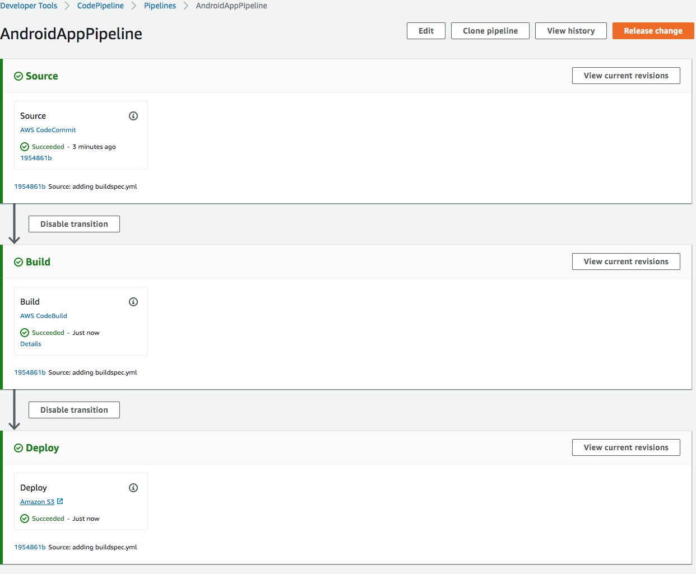
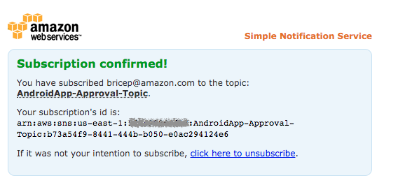
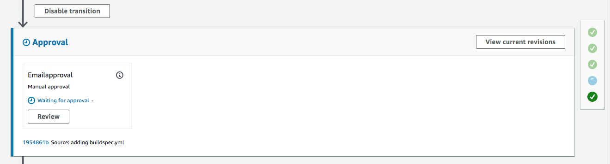

## Lab 2 - Setup CI/CD using AWS CodePipeline

### Stage 1: Create a Pipeline (Console)

To create a pipeline in the console, you'll need to provide the source file location and information about the providers you will use for your actions.

When you use the pipeline wizard, AWS CodePipeline creates the names of stages (Source, Build, Staging). These names cannot be changed. However, you can delete Build and Staging if you prefer to alter the names. You can give more specific names (for example, BuildToGamma or DeployToProd) to stages you add later.

Also, existing pipeline configuration can be exported and used to create pipeline in another region.

1. Sign in to the **AWS Management Console** and open the **AWS CodePipeline** console at [http://console.aws.amazon.com/codepipeline](http://console.aws.amazon.com/codepipeline).
2. On the **CodePipeline Home** page, choose **Create pipeline**.
3. On the **Step 1: Choose pipeline settings** page, in the **Pipeline name** box, type the name for your pipeline like **AndroidAppPipeline**.
4. For **Service role**, Select **Existing service role** and choose the Role name from drop down starting with **DevopsWorkshop**
5. Expand **Advanced settings**. For **Artifact store**, Select **Custom location** and choose the  Bucket from drop down starting with **cicd-workshop**, and then choose **Next**.

    **_Note_**
    Within a single AWS account, each pipeline you create in a region must have a unique name. Names can be reused for pipelines in different regions.

    After you create a pipeline, you cannot change its name. For information about other limitations, see [Limits in AWS CodePipeline](https://docs.aws.amazon.com/codepipeline/latest/userguide/limits.html).

6. On the **Step 2: Add source stage** page, in the **Source provider** drop-down list, choose the type of repository where your source code is stored and specify its required options:
  
     - **AWS CodeCommit**: In **Repository name**, choose the name of the AWS CodeCommit repository you created in Lab 1 to use as the source location for your pipeline. In **Branch name**, from the drop-down list, choose the **master** branch.
     - In **Change Detection Mode** leave the default selection of Amazon CloudWatch Events selection. Choose **Next**.
7. On the **Step 3: Add build stage** page, do the following
     - Choose **AWS CodeBuild**, and then **Select** an **existing build project** we created in Lab 1.
     - Then choose **Next**.
8. On the **Step 4: Add deploy stage** page, do the following, and then choose Next step:
     - Choose the following default providers from the **Deploy provider** drop-down list: **Amazon S3**. Type or choose the name of an existing Amazon S3 bucket that was created in **Lab1**. Set the **S3 object key** to **codepipeline-build/app-debug.apk** and then choose **Next**.
9. On the **Step 5: Review** page, review your pipeline configuration, and then choose **Create pipeline** to create the pipeline.
10. Now that you've created your pipeline, you can view it in the console. Pipeline will start automatically in few minutes. Otherwise, test it by manually clicking the **Release change** button.

Image below shows successfully executed pipeline.


***

### Stage 2: Add Manual approval action

In AWS CodePipeline, you can add an approval action to a stage in a pipeline at the point where you want the pipeline execution to stop so that someone with the required AWS Identity and Access Management permissions can approve or reject the action.

If the action is approved, the pipeline execution resumes. If the action is rejected—or if no one approves or rejects the action within seven days of the pipeline reaching the action and stopping—the result is the same as an action failing, and the pipeline execution does not continue.

1. **Create SNS topic** for Approval notification. And note the **topic ARN** from the result.

```console
aws sns create-topic --name AndroidApp-Approval-Topic --region <YOUR-REGION>
```

2. **Subscribe** to the topic using your email id. **Replace** the **ARN** and **email id** placeholders accordingly.

```console
aws sns subscribe --topic-arn <<YOUR-TOPIC-ARN>> \
--protocol email \
--notification-endpoint <<YOUR-EMAIL-ID>>
```

3. An Email would be sent for **confirmation** on the subscription. **Acknowledge** the subscription to receive mails from topic.



4. On the pipeline details page, choose **Edit**. This opens the editing page for the pipeline. Choose **+ Add stage** at the point in the pipeline between **Build** and **Deploy** stage, and type a name **Approval** for the stage.
5. Choose the **+ Add action group**.
6. On the **Edit action** page, do the following:
7. In **Action name**, type a name to identify the action like **EmailApproval**.
8. In **Action provider**, choose **Manual approval**.
9. In **SNS topic ARN**, choose the name of the topic created to send notifications for the approval action.
10. (Optional) In **Comments**, type any additional information you want to share with the reviewer.
11. Choose **Save**.
12. Save changes to pipeline by clicking **Save** button on top.
13. To test your action, choose **Release change** to process the latest commit through the pipeline, or commit a change to your source to trigger the pipeline.

***

### Stage 3: Approve or Reject an Approval Action in AWS CodePipeline

If you receive a notification that includes a direct link to an approval action, choose the **Approve or reject** link, sign in to the console if necessary, and then continue with step 7 below. Otherwise, use all the following steps.

1. Open the **AWS CodePipeline console** at https://console.aws.amazon.com/codepipeline/.
2. On the **All Pipelines** page, choose the name of the pipeline.
3. _Locate_ the stage with the approval action.
4. Hover over the information icon to view the comments and URL, if any. The information pop-up message will also display the URL of content for you to review, if one was included.
5. If a URL was provided, choose the **Manual approval** link in the action to open the target Web page, and then review the content.
6. Return to the pipeline details view, and then choose the **Review** button.
7. In the **Approve or reject** the revision window, type comments related to your review, such as why you are approving or rejecting the action, and then choose the **Approve** or **Reject** button.



Once you approve, the pipeline continues and completes successfully.

### Summary

This **concludes Lab 2**. In this lab, we successfully created CodePipeline for continuous code build and deployment to S3. We also modified CodePipeline to include manual approval action before deploying code to S3 for production. You can now move to the next Lab,

[Lab 3 - Using DeviceFarm as a Test Stage in CodePipeline](3_Lab3.md)
