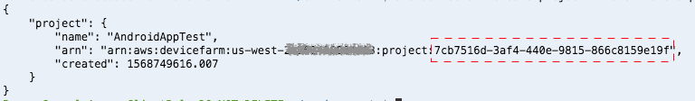
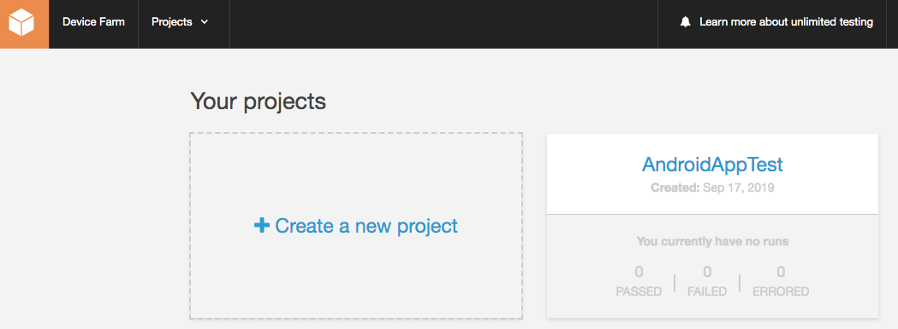
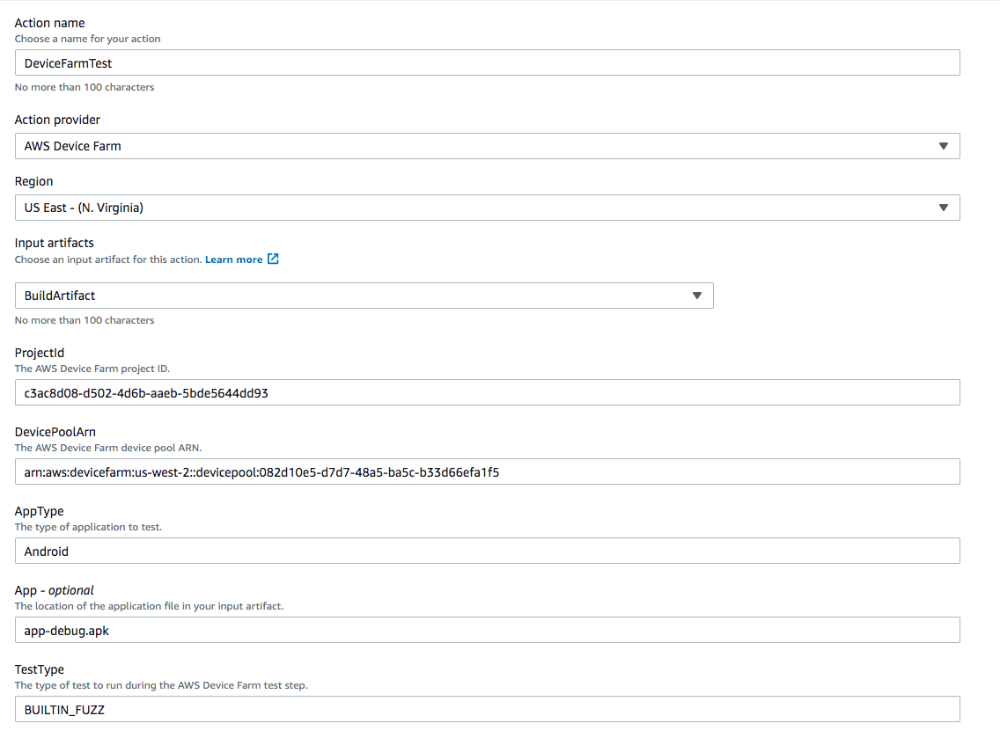
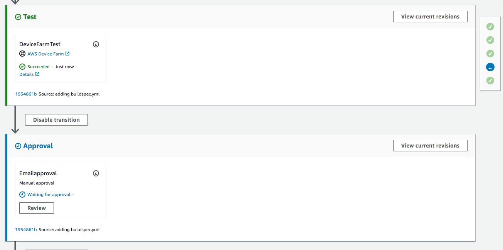

## Lab 3 - Using AWS Device Farm as Test Stage in CodePipeline

### Stage 1: Create a Device Farm project

1. Go to Cloud9 IDE
2. Run the following commands to create a new Device Farm project. Note: Device Farm is only available in the Oregon region (us-west-2). Do not change the region in the commands below
```console
aws devicefarm create-project --name AndroidAppTest --region us-west-2
```
3. Make note of the project ARN and the project ID (after "_project:_") returned by the command execution

4. Get the ARN of curated list of Top Devices available for the pool. A curated device pool is a pool that is created and managed by AWS Device Farm.
```console
aws devicefarm list-device-pools --arn <<YOUR-PROJECT-ARN>> --type CURATED --region us-west-2 | jq -r '.devicePools[]|select(.name=="Top Devices")|.arn'
```
5.  Review the deployment changes by visiting the [Device Farm console](https://us-west-2.console.aws.amazon.com/devicefarm).


***

### Stage 2: Add Device Farm Pipeline in the AWS CodePipeline Console

In this step, you will add a new stage to your pipeline, and then add an action — a test with Device Farm.

1. **Edit** the pipeline. Delete the **Deploy** stage.
2. Choose the option to add a stage after the **Build** stage with the AWS CodeBuild action. Type a name for the stage (for example, **Test**).

2. Choose **+ Add action group**,
- Type a name for your Device Farm action (for example, **DeviceFarmTest**).
- For **Action Provider**, choose **AWS Device Farm**.
- For **Region**, choose **us-west-2**.
- For **Input artifacts**, choose **BuildArtifact**.
- For **ProjectId**, enter the project ID you captured from Stage 1.
- For **DevicePoolArn**, enter the curated device pool ARN you captured from Stage 1.
- For **AppType**, enter **Android**
- For **App**, enter **app-debug.apk**
- For **TestType**, enter **BUILTIN_FUZZ**

3. Click **Done**. Finally, save changes to pipeline by clicking **Save** button on top



***

### Stage 3: Test the Pipeline with Device Farm

To test the function, release the most recent change through the pipeline.

**_To use the console to run the most recent version of an artifact through a pipeline_**

1. On the pipeline details page, choose **Release change**. This will run the most recent revision available in each source location specified in a source action through the pipeline.
2. When the Device Farm action is executing, choose the **Details** link to view the Fuzzy test details in the Device Farm console. Did the test fail? If it did, review the test run in the Device Farm console. Did the test succeed? If so, continue with the manual approval.



### Summary

This **concludes Lab 3**. In this lab, we successfully created a Device Farm project to test our application prior to deploying it to Amazon S3.

You can now proceed to cleanup all the resources

[Cleanup](README.md#clean-up)
