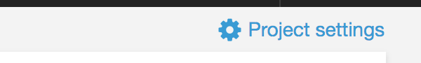
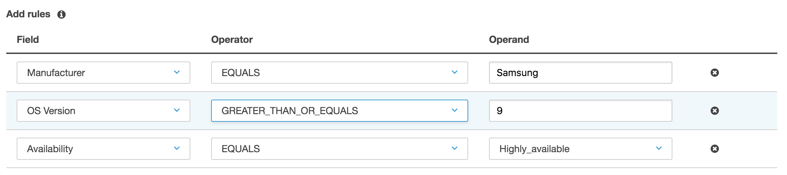
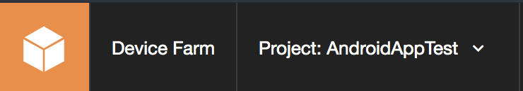
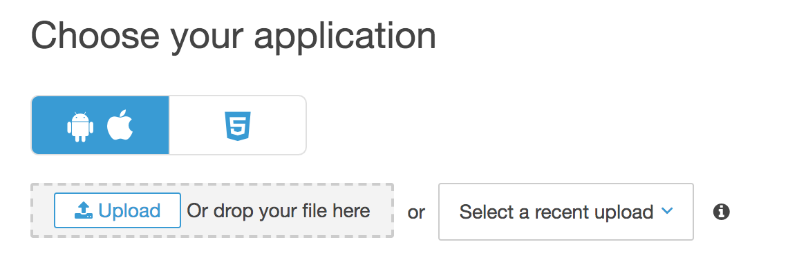
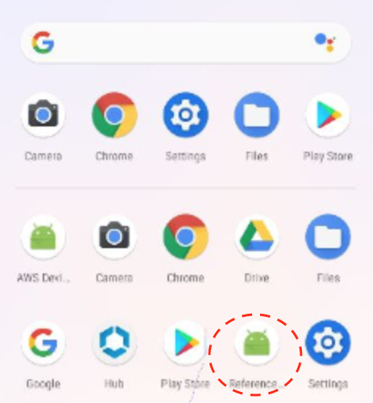
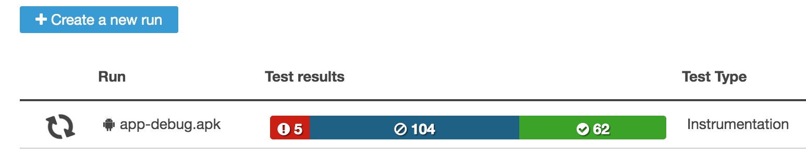

## Lab 4 - Hands-on with Device Farm

In this lab, you will interact directly with AWS Device Farm and run some instrumentation tests. 

### Stage 1: Create a device pool

1. Navigate to the [AWS Device Farm Console](https://us-west-2.console.aws.amazon.com/devicefarm/home).
2. Choose the project you created **Lab 3** and click **Project settings** in the upper right corner.
    
3. Choose the **Device pools** tab and and click **Create a new device pool**. create a new dynamic pool that adapt as new devices become available.
  - For **Name**, enter a name like "Dynamic Pool"
  - Add rules as shown below
    
  - Click **Save device pool**, and **done**
4. Return to the project by clicking your project name in the top left menu.
    

### Stage 2: Create a new run

1. Download the pre-built Android application [app-debug.apk](https://github.com/aws-samples/aws-device-farm-sample-app-for-android/raw/master/prebuilt/app-debug.apk) and the pre-built test suite [app-debug-androidTest.apk](https://github.com/aws-samples/aws-device-farm-sample-app-for-android/raw/master/prebuilt/app-debug-androidTest.apk)
    **_Note:_** Visit the [repo](https://github.com/aws-samples/aws-device-farm-sample-app-for-android#strategies-for-espresso) for more information about the Espresso tests
2. Click **+ Create a new run**
3. Under **Choose your application**, make sure you have selected the option to test native applications and upload the file **app-debug.apk**
    
4. Wait for the upload to complete and the processing to finish. Once completed, meta-data about the application is shown and a default **Run Name** is populated. Click **Next Step**.
5. In **Configure your test**, in the **Test** dropdown, select **Instrumentation** and upload the file **app-debug-androidTest.apk**. Wait for the processing to finish, then click **Next step**.
6. In **Select devices**, select the device pool that you just created in Stage 1. Click **Next Step**
7. In **Specify device state**, review the information and click **Next step**
8. In **Review and start run**, review the information. Change the **Execution timeout** to limit the execution duration of your test. Click **Confirm and start run**.
9.  You run is now scheduled and gets started momentarily.

### Stage 3: Remote Access

1. Return to the project by clicking your project name in the top left menu.
    
2. Select the **Remote access* tab and click **+ Start a new session**
3. In **Choose a device**, select a device such as the **Google Pixel 3 XL** and provide a **Session name**. Click **Confirm and start session**.
4. Your device is requested
5. When your device is ready, under **Install applications**, choose **Select a recent upload** and pick **app-debug.apk** that you just provided.
6. Wait for the application to be installed. You will find it in the application drawer.
    
7. Click on the newly installed application to interact with it.

### Stage 4: check on last run

1. Return to the project by clicking your project name in the top left menu.
    
2. Check on the status of the run you started
    
3. Click on the run. Drill down all the way down to a test execution ( run > job > suite > test). what do you see? Did that test pass?

### Summary

This **concludes Lab 4**. In this lab you went hands-on with Device Farm and learned how to create dynamic device pools and runs with instrumentation testing.

You can now proceed to cleanup all the resources: [Cleanup](README.md#clean-up).
